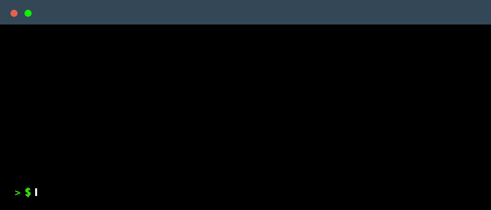

# What's New 

Here we're with a new version that comes new features and base code improvement.

<!--truncate-->

# New Features

Here's a list of what's been added to Letme.

## CLI Changes

The following commands have been removed:

- `letme init`
- `letme list --local`

The following commands have been either modified or replaced:

- `letme config-file` and `letme config` have been unified and flags **have been replaced** by different subcommands:

```bash
❯ letme config
Manage contexts and more.

Usage:
  letme config [flags]
  letme config [command]

Available Commands:
  get-contexts   Get active and avalaible contexts.
  new-context    Create a new context.
  switch-context Switch to a context.
  update-context Change context values.
  validate       Validate the config file.
  view-template  View the a sample configuration file template

Flags:
  -h, --help   help for config

Global Flags:
  -v, --version   list current version for letme

Use "letme config [command] --help" for more information about a command.
```

## Create contexts

Before we had to manually configure and edit `~/.letme/letme-config` file. Now we can do so through  `letme config`:

```bash
❯ letme config new-context lockedinspace
letme: creating/updating context 'lockedinspace'. Optional fields can be left empty.
→ AWS Source Profile Name: letme
→ AWS Source Profile Region: eu-central-1
→ AWS DynamoDB Table Name: letme-accounts-table
→ AWS MFA Device arn (optional): 
→ Token Session Duration in seconds (optional): 
→ Session Name (optional): 
Created letme 'lockedinspace' context.
```

## Multiple contexts

Before we had to have multiple `~/.letme/letme-config` files to be able to have different DynamoDB tables. Now, we can do so by switching contexts. 

For example, here's a `~/.letme/letme-config` file with multiple contexts:

```ini
[letme]
aws_source_profile        = letme
aws_source_profile_region = eu-west-1
dynamodb_table            = cross-account-credentials-letme
mfa_arn                   = arn:aws:iam::4002019901:mfa/1pwd
session_name              = user_letme
session_duration          = 3600


[lockedinspace]
aws_source_profile        = lockedinspace
aws_source_profile_region = us-east-1
dynamodb_table            = cross-account-credentials-lockedinspace
mfa_arn                   = arn:aws:iam::5256715791:mfa/google-auth
session_name              = lockedinspace
session_duration          = 900
```

If we want to select lockedinspace context we can do so by using this command:

```bash
letme config switch-context lockedinspace
```

We can check our current and the full list of contexts by using this command:

```bash
letme config get-contexts
```

Here's a real example:



## Credentials process

This is a new implementation of the `obtain` command. Now, instead of executing `letme obtain` every time our credentials have been expired, we can leverage this to AWS CLI.

:::info
For more information, see: [AWS CLI configure credential process](https://docs.aws.amazon.com/cli/v1/userguide/cli-configure-sourcing-external.html)
:::

:::warning
**This implementation currently not works with MFA.**
:::

## Renew

Before, every time we executed `letme obtain` new credentials were generated (**even though they were still valid**). 

Now, if credentials are valid, **no call to the Assume Role API will be made and you'll use the same credentials**. But with the addition of `--renew` flag you can force the generation of new credentials:

```bash
❯ letme obtain lockedinspace        
Assuming role with the following session name: 'lockedinspace' and context: 'lockedinspace'
letme: using cached credentials. Use argument --renew to obtain new credentials.
letme: use the argument --profile 'lockedinspace' to interact with the account.

❯ letme obtain lockedinspace --renew
Assuming role with the following session name: 'lockedinspace' and context: 'lockedinspace'
Enter MFA one time pass code: 059829
letme: use the argument --profile 'lockedinspace' to interact with the account.
```

## Bug fixes and Improvements

- Migrated to `aws-go-sdk-v2`.
- Handled ini files through ini standard library.
- Removed not used libraries.
- Standarized output and behaviours (assume-role, reading aws files, etc.).
- Removed unneeded code.
- `letme list` width is now dynamic and output will be based on the length of the longest item.
