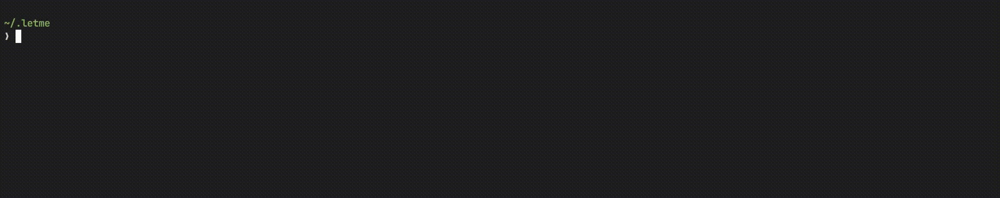

# Configure Letme

Let's translate `docs/intro.md` to French.

## Generate config file

First of all, we need to create `.letme/letme-config` file:
```bash
letme config-file
```

This will generate a config file with a default context **(must be modified)**:

```ini
[default]
aws_source_profile        = default
aws_source_profile_region = eu-west-3
dynamodb_table            = customers
mfa_arn                   = arn:aws:iam::4002019901:mfa/user
session_name              = user_letme
session_duration          = 3600
```

:::tip
To get `mfa_arn` run:
```bash
aws iam list-mfa-devices --query 'MFADevices[].SerialNumber'
```
:::

Here's a list of all configurable fields on `.letme/letme-config`

| Key                           | Description | Default value | Required | Type |
| ----------------------------- | ----------- | ------------- | -------- | ---- |
| ``aws_source_profile``        | The AWS CLI profile name which maps to the source account. This profile must held the DynamoDB table. [[1]](https://docs.aws.amazon.com/IAM/latest/UserGuide/reference_policies_elements_principal.html) | ``default`` | No | ``string`` |
| ``aws_source_profile_region`` | The region name in the source account where the DynamoDB table is located [[2]](https://docs.aws.amazon.com/AWSEC2/latest/UserGuide/using-regions-availability-zones.html) | ``-`` | Yes | ``string`` |
| ``dynamodb_table``            | The DynamoDB table name where the AWS accounts are stored [3](../aws/dynamodb-infrastructure.md) | ``-`` | Yes | ``string`` |
| ``mfa_arn``                   | Virtual MFA device arn used to authenticate against AWS [[4]](https://docs.aws.amazon.com/cli/latest/reference/iam/list-mfa-devices.html)  | ``-`` | No (depending on your AWS trust relationship policy) | ``string`` |
| ``session_name``              | The session name when performing assumeRole requests [[5]](https://awscli.amazonaws.com/v2/documentation/api/2.0.33/reference/sts/assume-role.html#options)| ``${account_name}-letme-session`` | No | ``string`` |
| ``session_duration``          | Token validity in seconds [[6]](https://docs.aws.amazon.com/IAM/latest/UserGuide/id_roles_use.html#id_roles_use_view-role-max-session)| ``${account_name}-letme-session`` | No | ``string`` |


## Contexts

When you work on a consultory, you may require to use different AWS IAM Users and different DynamoDB tables. When this happens, you can create multiple contexts on your `.letme/letme-config`. For example:

```ini
[letme]
aws_source_profile        = letme
aws_source_profile_region = eu-west-1
dynamodb_table            = cross-account-credentials-letme
mfa_arn                   = arn:aws:iam::4002019901:mfa/1pwd
session_name              = user_letme
session_duration          = 3600


[lockedinspace]
aws_source_profile        = lockedinspace
aws_source_profile_region = us-east-1
dynamodb_table            = cross-account-credentials-lockedinspace
mfa_arn                   = arn:aws:iam::5256715791:mfa/google-auth
session_name              = lockedinspace
session_duration          = 900
```

As you can see there two section with different configuration that we can choose:

- List current context:
```bash
letme config
```
- Change context:
```bash
letme config --context lockedinspace
```

