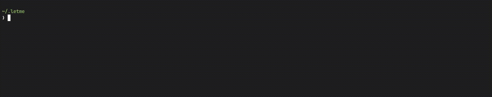

# Config

Lets you interact with contexts defined in `.letme/letme-config`.



## Commands

- List contexts:

```bash
letme config
```

- Change context:

```bash
letme config --context ${CONTEXT_NAME}
```
